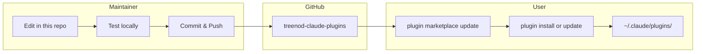
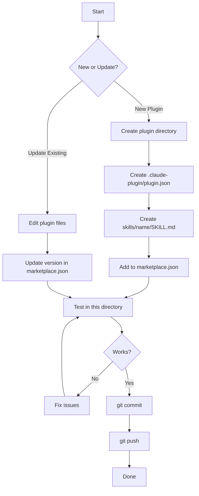
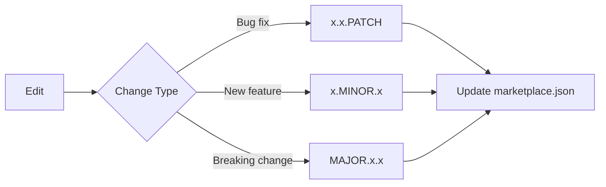
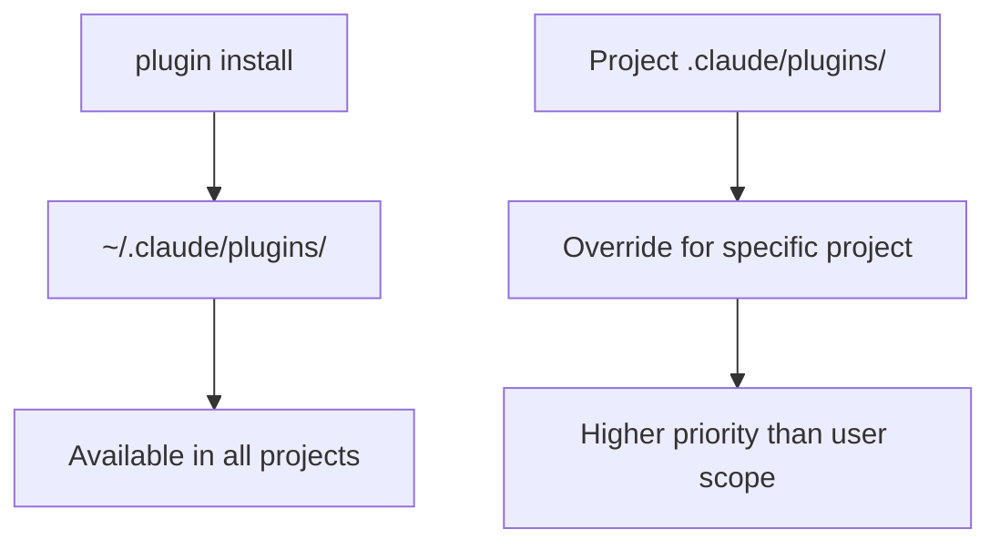

# Treenod Claude Code Plugins

Internal plugin marketplace for Treenod organization.

## Available Plugins

| Plugin | Category | Description |
|--------|----------|-------------|
| atlassian | productivity | Confluence and Jira API integration |
| document-hoarder | productivity | Confluence documentation fetcher |
| sheet | productivity | Google Sheets API integration |
| skill-creator | development | Guide for creating Claude Code skills |
| sql-writer | data | Databricks SQL query generator |

## Directory Structure

```
treenod-claude-plugins/
├── CLAUDE.md                     # Context for Claude Code
├── README.md                     # This file
├── .claude-plugin/
│   └── marketplace.json          # Plugin catalog
└── plugins/
    └── <plugin-name>/
        ├── .claude-plugin/
        │   └── plugin.json       # Plugin manifest
        └── skills/
            └── <skill-name>/
                ├── SKILL.md      # Skill definition
                ├── scripts/      # Python scripts
                └── references/   # Reference docs
```

## Workflow Overview



## Maintainer Guide

### Development Workflow



### Create New Plugin

```bash
# 1. Create directory structure
mkdir -p plugins/<name>/.claude-plugin
mkdir -p plugins/<name>/skills/<name>

# 2. Create plugin.json
cat > plugins/<name>/.claude-plugin/plugin.json << 'EOF'
{
  "name": "<name>",
  "description": "Plugin description",
  "author": {
    "name": "Treenod Dev Team",
    "email": "dev@treenod.com"
  }
}
EOF

# 3. Create SKILL.md
cat > plugins/<name>/skills/<name>/SKILL.md << 'EOF'
---
name: <name>
description: Skill description
---

# Skill Title

Documentation content...
EOF

# 4. Add to marketplace.json (plugins array)
# 5. Test by running Claude Code in this directory
# 6. Commit and push
```

### Update Existing Plugin

```bash
# 1. Edit plugin files
# 2. Update version in marketplace.json
# 3. Update CHANGELOG.md (if exists)
# 4. Test locally
# 5. Commit and push
```

### Version Management



## User Guide

### First-Time Setup

```bash
# Add marketplace
/plugin marketplace add treenod/treenod-claude-plugins

# List available plugins
/plugin

# Install plugins
/plugin install atlassian@treenod-plugins
/plugin install sql-writer@treenod-plugins
```

### Update Plugins

```bash
# Refresh marketplace catalog
/plugin marketplace update treenod-plugins

# Update specific plugin
/plugin update atlassian@treenod-plugins
```

### Installation Scope



## Prerequisites

### atlassian / document-hoarder
- `ATLASSIAN_USER_EMAIL`
- `ATLASSIAN_API_TOKEN`
- `JIRA_URL`

### sheet
- Google Cloud project with Sheets API enabled
- `gcloud` CLI authenticated

### sql-writer
- Databricks workspace access
- Connection configured

## Support

Contact: dev@treenod.com
