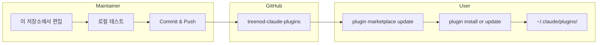
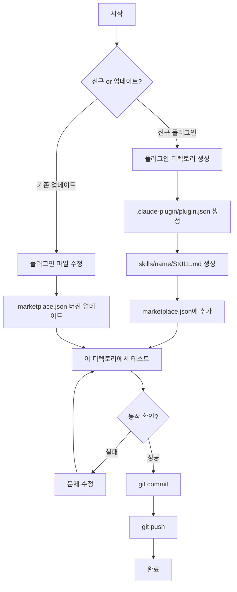
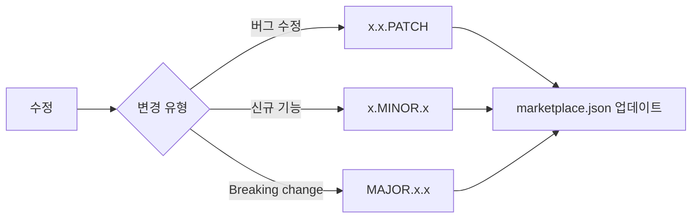
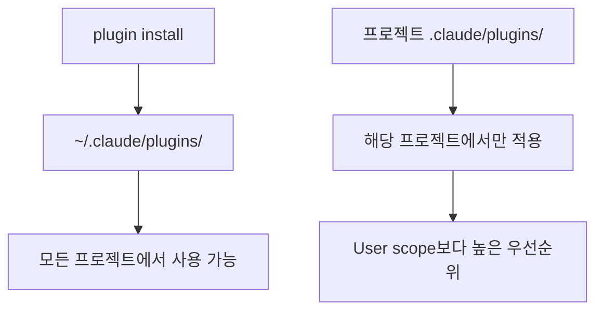

# Treenod Claude Code Plugins

Treenod 내부용 Claude Code 플러그인 마켓플레이스

## 플러그인

단일 `util` 플러그인에 모든 스킬이 포함되어 있습니다.

| Skill | Category | Description |
|-------|----------|-------------|
| atlassian | productivity | Confluence, Jira API 연동 |
| document-hoarder | productivity | Confluence 문서 로컬 동기화 |
| sheet | productivity | Google Sheets API 연동 |
| skill-creator | development | Claude Code skill 생성 가이드 |
| sql-writer | data | Databricks SQL 쿼리 생성기 |

## 디렉토리 구조

```
treenod-market/
├── CLAUDE.md                     # Claude Code 컨텍스트
├── README.md                     # 이 문서
├── .claude-plugin/
│   └── marketplace.json          # 플러그인 카탈로그
└── plugins/
    └── util/                     # 통합 유틸리티 플러그인
        ├── .claude-plugin/
        │   └── plugin.json       # 플러그인 매니페스트
        └── skills/
            ├── atlassian/        # Confluence, Jira API
            ├── document-hoarder/ # Confluence 문서 동기화
            ├── sheet/            # Google Sheets API
            ├── skill-creator/    # Skill 생성 가이드
            └── sql-writer/       # Databricks SQL
```

## 워크플로우 개요



## 관리자 가이드

### 개발 워크플로우



### 신규 스킬 추가

```bash
# 1. 스킬 디렉토리 생성
mkdir -p plugins/util/skills/<skill-name>

# 2. SKILL.md 생성
cat > plugins/util/skills/<skill-name>/SKILL.md << 'EOF'
---
name: <skill-name>
description: Skill 설명
---

# Skill 제목

문서 내용...
EOF

# 3. 이 디렉토리에서 Claude Code 실행하여 테스트
# 4. Commit and push
```

### 기존 스킬 업데이트

```bash
# 1. 스킬 파일 수정
# 2. 버전 업데이트 (두 파일 모두 수정 필요)
#    - plugins/util/.claude-plugin/plugin.json
#    - .claude-plugin/marketplace.json
# 3. 로컬 테스트
# 4. Commit and push
```

### 버전 관리



## 사용자 가이드

### 최초 설정

```bash
# 마켓플레이스 추가
/plugin marketplace add treenod-drew/treenod-market

# 설치 가능한 플러그인 목록 확인
/plugin

# util 플러그인 설치 (모든 스킬 포함)
/plugin install util@treenod-plugins
```

### 플러그인 업데이트

```bash
# 마켓플레이스 카탈로그 갱신
/plugin marketplace update treenod-plugins

# util 플러그인 업데이트
/plugin update util@treenod-plugins
```

### 설치 범위



## 사전 요구사항

### atlassian / document-hoarder
- `ATLASSIAN_USER_EMAIL`
- `ATLASSIAN_API_TOKEN`
- `JIRA_URL`

### sheet
- Google Cloud 프로젝트 (Sheets API 활성화)
- `gcloud` CLI 인증 완료

### sql-writer
- Databricks workspace 접근 권한
- Connection 설정 완료
