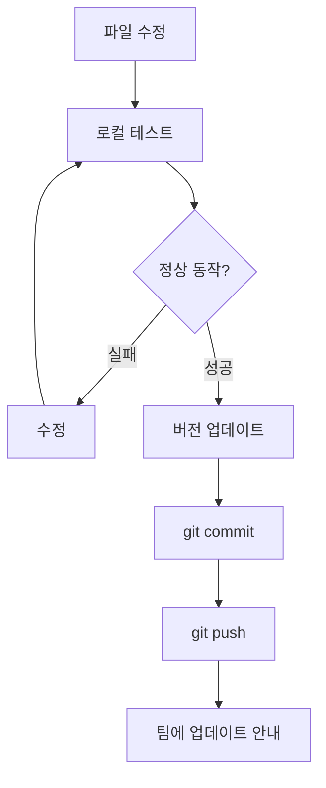

플러그인 관리자를 위한 개발 및 배포 가이드.

## 저장소 구조

```
treenod-market/
├── .claude-plugin/
│   └── marketplace.json          # 마켓플레이스 카탈로그
├── plugins/
│   └── util/
│       ├── .claude-plugin/
│       │   └── plugin.json       # 플러그인 매니페스트
│       ├── docs/                 # 문서
│       └── skills/
│           ├── atlassian/
│           ├── document-hoarder/
│           ├── sheet/
│           ├── skill-creator/
│           └── sql-writer/
└── README.md
```

## 개발 환경 설정

### 저장소 클론

```bash
git clone https://github.com/treenod-IDQ/treenod-market.git
cd treenod-market
```

### 로컬 테스트

이 디렉토리에서 Claude Code 실행 시 스킬이 자동으로 로드됨:

```bash
cd treenod-market
claude
```

## 스킬 추가

### 디렉토리 생성

```bash
mkdir -p plugins/util/skills/<skill-name>
```

### SKILL.md 작성

`plugins/util/skills/<skill-name>/SKILL.md`:

```markdown
---
name: <skill-name>
description: 스킬 설명 (한 줄)
---

# 스킬 제목

## 개요

스킬이 하는 일 설명.

## 사용법

사용 예시 및 설명.

## 필수 설정

필요한 환경 변수, 인증 등.
```

### plugin.json 수정

`plugins/util/.claude-plugin/plugin.json`에 새 스킬 등록:

```json
{
  "skills": [
    {
      "name": "<skill-name>",
      "description": "스킬 설명",
      "skillFile": "skills/<skill-name>/SKILL.md"
    }
  ]
}
```

## 스킬 업데이트

### 파일 수정

스킬 파일 직접 수정.

### 버전 업데이트

두 파일 모두 버전 업데이트 필요:

1. `plugins/util/.claude-plugin/plugin.json`
2. `.claude-plugin/marketplace.json`

### 버전 규칙

Semantic Versioning 사용:

- PATCH (x.x.1): 버그 수정
- MINOR (x.1.x): 신규 기능 추가
- MAJOR (1.x.x): Breaking change

## 배포 워크플로우



### 커밋 및 푸시

```bash
git add .
git commit -m "Add/Update <skill-name> skill"
git push
```

### 팀 안내

업데이트 후 팀원에게 플러그인 업데이트 안내:

```bash
/plugin marketplace update treenod-plugins
/plugin update util@treenod-plugins
```

## 스킬 파일 구조

각 스킬 디렉토리 구조:

```
skills/<skill-name>/
├── SKILL.md              # 필수: 스킬 정의
├── CLAUDE.md             # 선택: 추가 컨텍스트
└── <supporting-files>    # 선택: Python 스크립트 등
```

### SKILL.md 구성요소

- YAML frontmatter: name, description 필수
- 개요: 스킬의 목적과 기능
- 사용법: 구체적인 사용 예시
- 필수 설정: 환경 변수, 인증 요구사항
- 참고: 관련 문서 링크

### CLAUDE.md 활용

복잡한 스킬의 경우 CLAUDE.md에 추가 컨텍스트 제공:

- 내부 API 엔드포인트
- 데이터베이스 스키마
- 코드 스니펫

## 기존 스킬 참고

각 스킬의 구현 예시:

| Skill | 특징 |
|-------|------|
| atlassian | REST API 호출, ADF 변환 |
| document-hoarder | 파일 시스템 작업 |
| sheet | Google API 인증 |
| skill-creator | 메타 가이드 |
| sql-writer | SQL 생성, 스키마 참조 |

## 문제 해결

### 스킬이 로드되지 않음

- plugin.json에 스킬 등록 확인
- SKILL.md frontmatter 형식 확인
- Claude Code 재시작

### 버전 충돌

marketplace.json과 plugin.json의 버전 일치 확인.

### 테스트 환경 분리

프로덕션 토큰 대신 테스트용 토큰 사용 권장.
