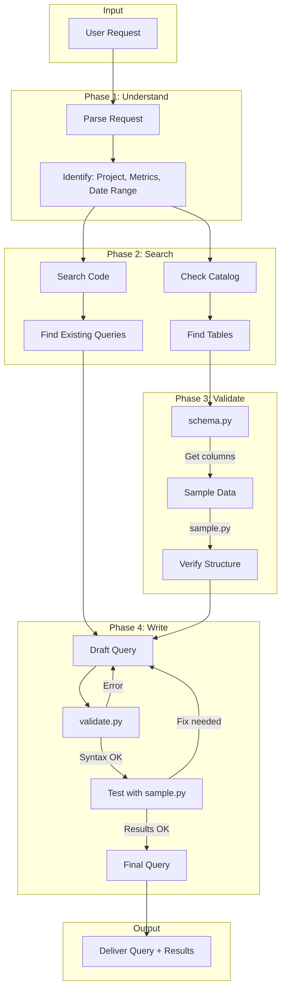
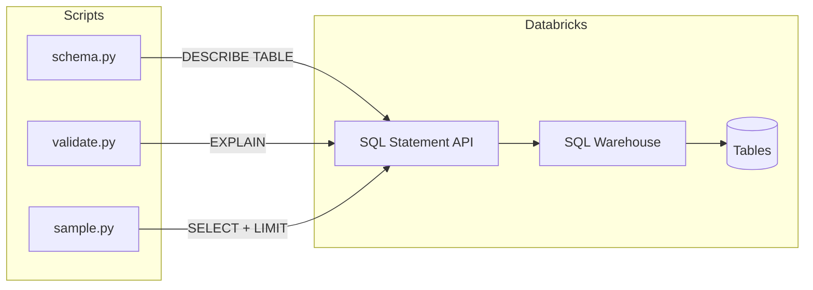
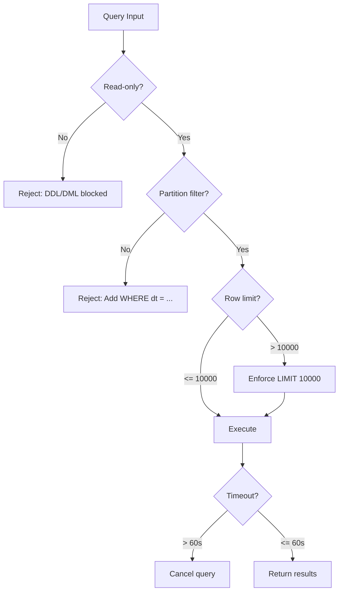
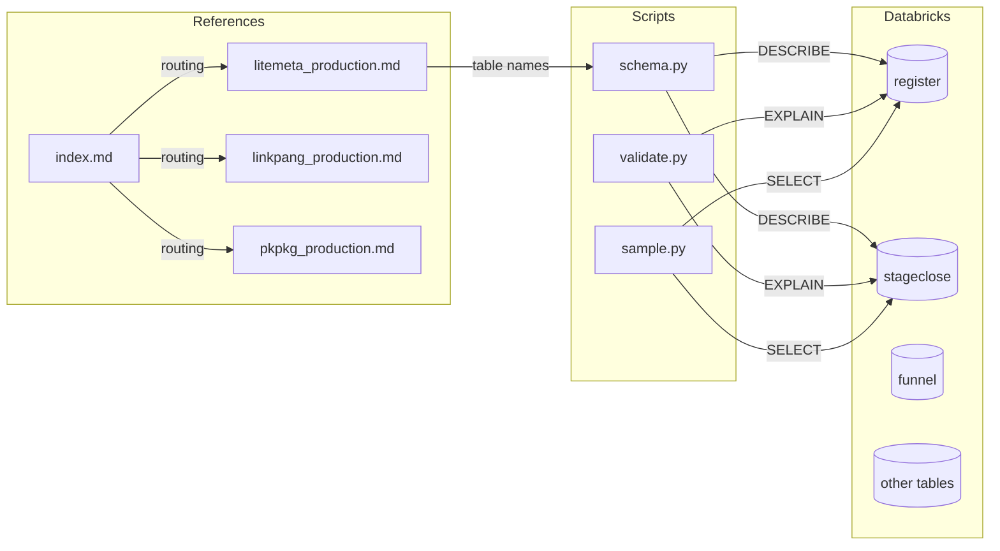

# SQL Writer Skill Workflow

## Overview

```mermaid
flowchart TB
    subgraph Input
        U[User Request]
    end

    subgraph Phase1[Phase 1: Understand]
        U --> P[Parse Request]
        P --> I[Identify: Project, Metrics, Date Range]
    end

    subgraph Phase2[Phase 2: Search]
        I --> C[Check Catalog]
        I --> S[Search Code]
        C --> T[Find Tables]
        S --> Q[Find Existing Queries]
    end

    subgraph Phase3[Phase 3: Validate]
        T --> SC[schema.py]
        SC --> |Get columns| SM[Sample Data]
        SM --> |sample.py| V[Verify Structure]
    end

    subgraph Phase4[Phase 4: Write]
        Q --> D[Draft Query]
        V --> D
        D --> VA[validate.py]
        VA --> |Syntax OK| TE[Test with sample.py]
        VA --> |Error| D
        TE --> |Results OK| F[Final Query]
        TE --> |Fix needed| D
    end

    subgraph Output
        F --> R[Deliver Query + Results]
    end
```

## Script Flow

```mermaid
flowchart LR
    subgraph Scripts
        direction TB
        SC[schema.py]
        VA[validate.py]
        SA[sample.py]
    end

    subgraph Databricks
        API[SQL Statement API]
        WH[SQL Warehouse]
        TB[(Tables)]
    end

    SC --> |DESCRIBE TABLE| API
    VA --> |EXPLAIN| API
    SA --> |SELECT + LIMIT| API
    API --> WH
    WH --> TB
```

## Safety Checks

```mermaid
flowchart TD
    Q[Query Input] --> S1{Read-only?}
    S1 --> |No| R1[Reject: DDL/DML blocked]
    S1 --> |Yes| S2{Partition filter?}
    S2 --> |No| R2[Reject: Add WHERE dt = ...]
    S2 --> |Yes| S3{Row limit?}
    S3 --> |> 10000| L[Enforce LIMIT 10000]
    S3 --> |<= 10000| E[Execute]
    L --> E
    E --> T{Timeout?}
    T --> |> 60s| R3[Cancel query]
    T --> |<= 60s| O[Return results]
```

## Data Flow

```mermaid
flowchart LR
    subgraph References
        IX[index.md]
        LM[litemeta_production.md]
        LP[linkpang_production.md]
        PK[pkpkg_production.md]
    end

    subgraph Scripts
        SC[schema.py]
        VA[validate.py]
        SA[sample.py]
    end

    subgraph Databricks
        RE[(register)]
        ST[(stageclose)]
        FU[(funnel)]
        OT[(other tables)]
    end

    IX --> |routing| LM
    IX --> |routing| LP
    IX --> |routing| PK
    LM --> |table names| SC
    SC --> |DESCRIBE| RE
    SC --> |DESCRIBE| ST
    VA --> |EXPLAIN| RE
    VA --> |EXPLAIN| ST
    SA --> |SELECT| RE
    SA --> |SELECT| ST
```
